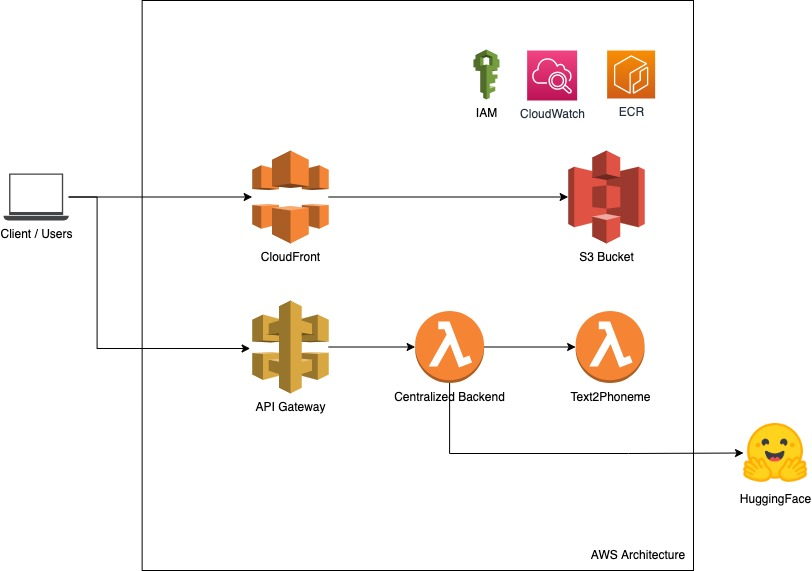

# Speech Rehearsal  

## Main Objective:

- Pronouncing a word incorrectly can make a speech difficult to follow. It can also make the audience miss your important idea.
- Hence, the goal of this tool is to help people rehearse for their presentation by providing feedback on their speech.

## Building block for this:

- ML-based model to transcript raw audio file into phonemes.
- A model to convert scripts (in text) into phonemes.
- An algorithm to align between phonemes from speech and from texts.
- A Text-to-speech model to give feedback to users on the correct pronunciation
- UI interface for users to use.

## Progresses:

- [Progress #2: June 13 - July 2](./progress2.md)
- [Progress #1: June 1 - June 12](./progress1.md)
- Progress #0: Building ML models, but I forgot to document them.