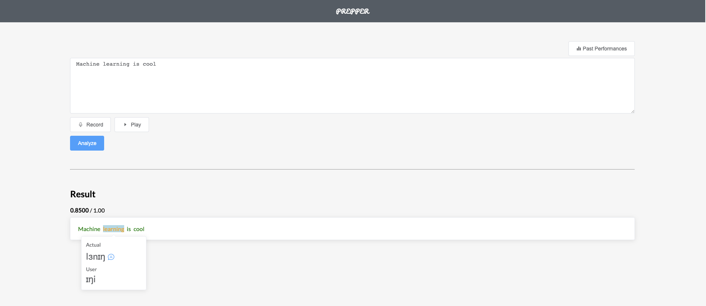
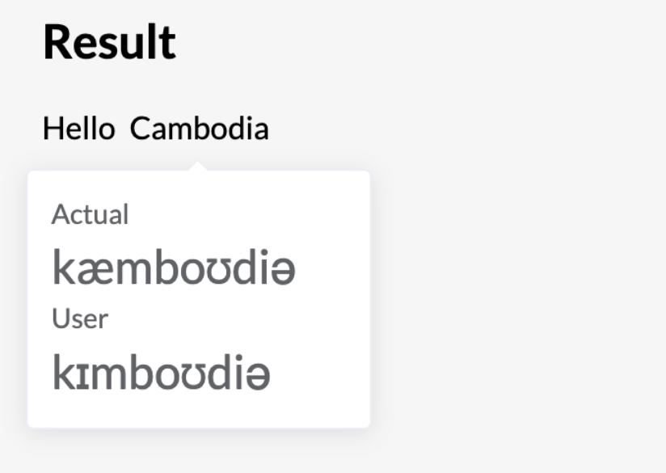
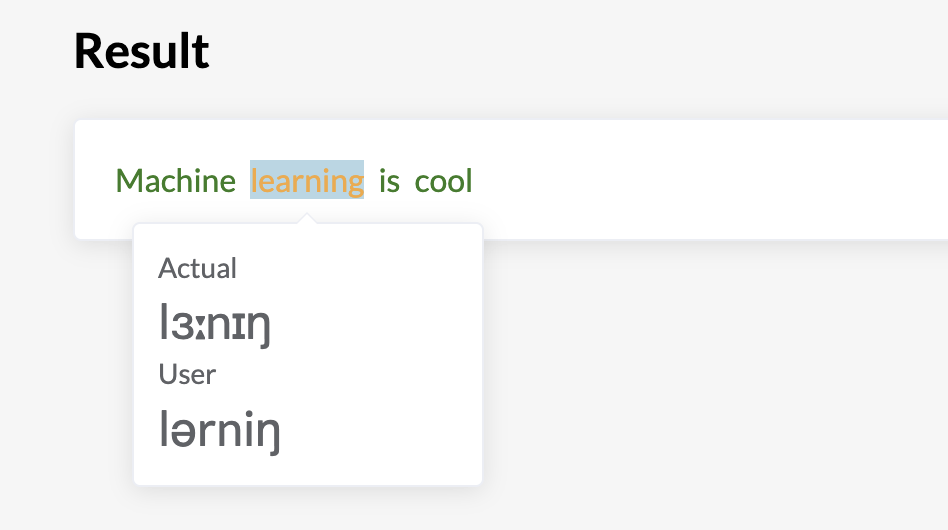
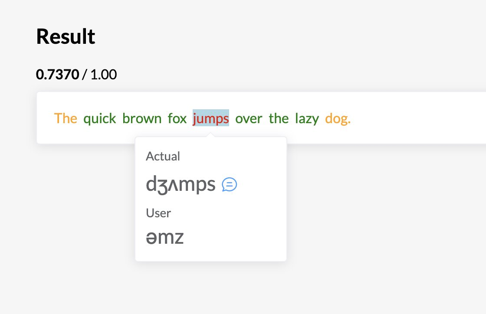
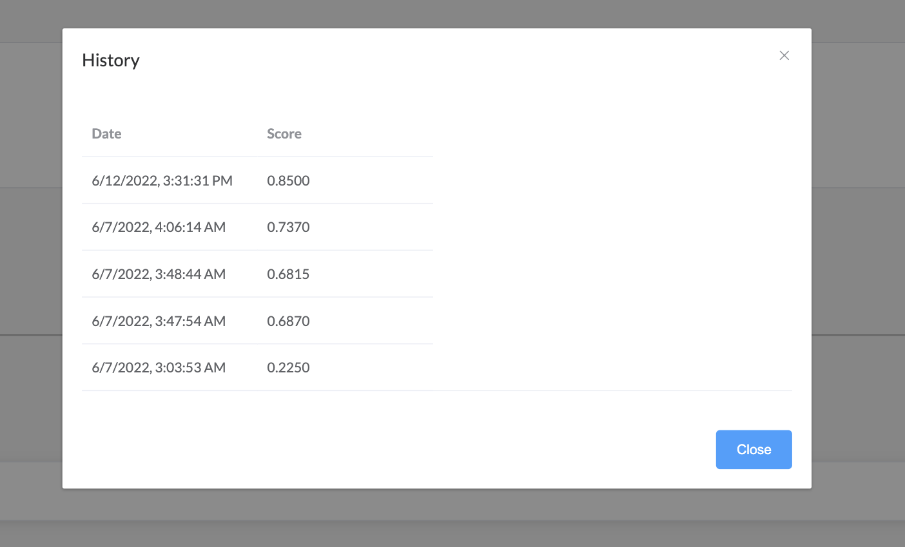
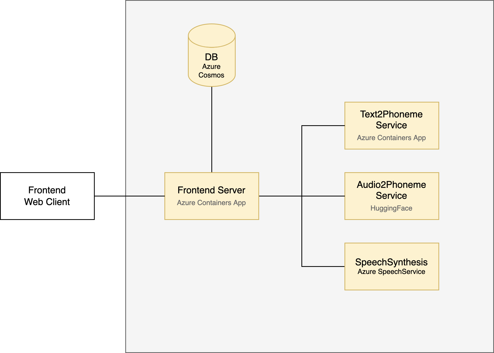

# Progress 1: Fundamental
### Date: June 01 - 12

## Current Iteration

User first enter the text they want to practice. They record their voice. Hit analyze and the system will process everything and output which words are correctly or incorrectly pronounced.

## Components

This work is based on an iterative process. We quickly put things together to see how it would interact with its components. Then, we pick an aspect and improve on it. Sadly, we forgot capture the early iteration of this tool. 

### 1. Feedback design on correct words

The initial version does not provide proper feedback in a glance which word we get it right and which word we don’t. We have to go in manually. 

With proper color usage, we can easily know which one we need to improve on further.

No Feedback            |  With Feedback
:-------------------------:|:-------------------------:
  |  

### 2. Text-to-Speech

We should not expect every user to know how to read phonetics. It is not that straight-forward. Then, we decide to add TTS feature so that users can know the correct pronunciation of a word.

### 3. Scoreboard

We think that it would be useful if we can let users know their growths over time. Thus, we integrated a scoreboard by storing users score onto a database. In this case, we are using Azure CosmosDB. 

We don’t want users to go through some hectics process of signing up and login, so we just randomly generate user id for each user utilizing local storage on a web browser. As long as they are using that same browser, they can conveniently see their score.

FYI, we tried to add ChartJS for awesome visualization. But we encounter some compatibility issue between ChartJS with VueJS + NuxtJS 2. At the time of this experiment, there is ChartJS for VueJs 3 already.

### 4. Dockerize & Hosting

- For ease of moving these components around later on, we put all of them into a separate container.
- For all these we deploy them on Azure. The reason is because we are submitting this project to an Azure Responsible AI Hackathon which requires using Azure services. Below is a figure demonstrating our architecture design for the current solution.

## Limitation and Future Work

- Slow startup speech for HuggingFace Speech to Phoneme. The cold start on Huggingface takes around 53 seconds on average. It’s cumbersome process. And sometimes, it also fails to boot.
- Phoneme alignment algorithm when comparing between phoneme from text and from audio are somewhat limited. Frequently, a phoneme for word at index ends up placed at the next word. Hence, it is hard to user to know what’s going on.
- Speech-to-phoneme transcript is somewhat limited. We only train that using native English speakers only. Applying that to diverse group of people is not robust enough. Fortunately, we already have a new model ready, which we will integrate in the next update.