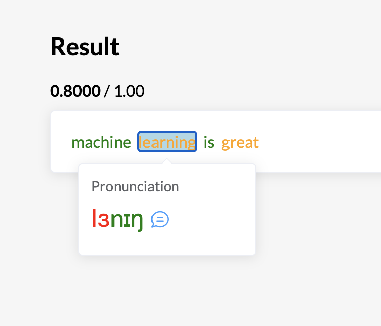
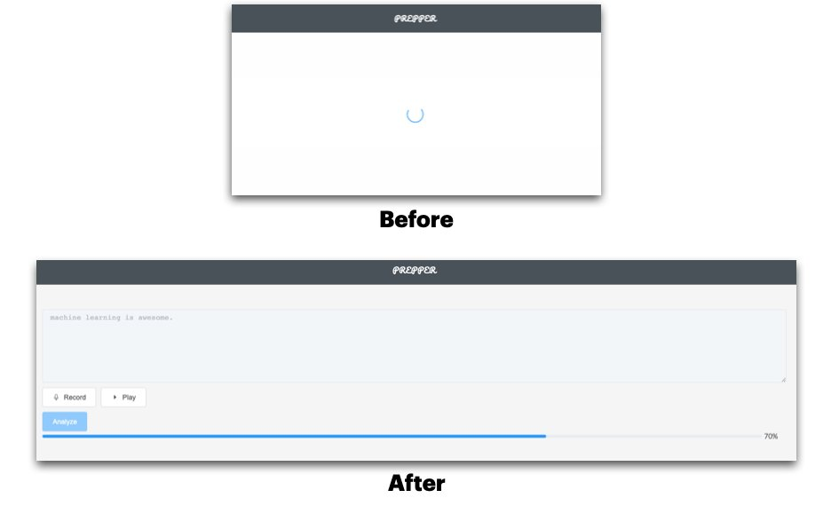
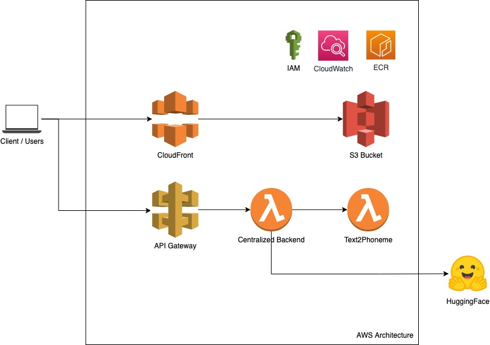

# Progress 2: Security & Hosting on AWS 
### Date: June 13 - July 02

## Main Objective

The ultimate goal for these two weeks is the following:

- Improving the interface and system to be more user-friendly
- Switch to hosting on AWS instead of on Azure Cloud
- Deal with security aspects during the hosting

## I. Experience Improvement

### **Improve the Feedback UX**

Previously, we show both the user audio’s phoneme and the actual expected one. In this case, it is very transparent for users to know what is going on behind the scene. However, after some trial attempts, we find out that it can be somewhat confusing due to the limitation of (i) the audio-to-phoneme model and (ii) the phoneme alignment algorithm.

Then, we decide to make this easier to work with. We only show the expected output along with some feedback on which part needs to be worked on further. We find this to be easier to understand than the former one.

Before           |  After
:-------------------------:|:-------------------------:
  |  

### **Change Loading Screen**

Initially, we try to get the early prototype out the door. We chose to block the entire screen with a loading circle when the user clicks analyze. This means that users should have to do absolutely nothing for about 1 minute staring at nothing but a circle.

Note that this takes that long because of HuggingFace loading time. Actually, we can make the HuggingFace model available 24/7 for 30USD a month, but we chose not to do so because this is still in an early MVP.

Anyway, we replace that circle with a progress bar and block other functionality like editing the text or analyze button. In this case, users can read the text or listen to their own voices while waiting.

### **Threshold and Normalization**

We realize that there are some mismatches between phonemes from transcription (audio2phoneme) using **the Transformer model** and from the text (text2phoneme) using **espeak-ng**. Hence, we revisit the material based on [https://en.wikipedia.org/wiki/ARPABET](https://en.wikipedia.org/wiki/ARPABET). We manually convert phoneme that only exists on espeak-ng and map that to the closest phoneme in Transformer.

Note that during training audio2phoneme, we group and similar some phonemes into only a collection of 39 phonemes (based on a research paper).

We also change the threshold for the score. Word with a score above 65% will be marked as green. 25% upward is considered orange. Setting a more strict threshold can de-motivate users from learning and improving.

For future notes, we are thinking of letting users set their difficulties. And the threshold would be reflected based on that preference.

## II. Hosting on AWS

Initially, we hosted on the Azure cloud because this was a part of a Microsoft Responsible AI hackathon. And the Azure cloud is the requirement for the submission. So, after the hackathon, we switch back to AWS cloud service.

Overview for an Architecture on AWS

This is our first time trying to put all these different services onto AWS. It’s pretty interesting. Let us walk through each component. Note that we are trying to minimize the expense as much as possible because we don’t know how much traffic we will be serving.

### **CloudFront + S3**

Previously, we dockerize NuxtJS application (based on VueJS) into a container. This would hold both frontend and express-based backend. It was pretty easy to work with. However, hosting that on AWS can bare some costs on idling. If we put the container into the lambda function, the load is too heavy. A user would have to stare at the blank screen for 4 to 10 seconds as the container is booting up before they can press anything.

Therefore, we split the NuxtJS into two separate components - static and backend. The NuxtJS is based on VueJS which can be considered a single-page application. We take the SPA static and put it into an S3 bucket. Who could have thought we can use an S3 bucket to host a static webpage? Considering this is a SPA, it’s just perfect.

Then, we incorporate that with **CloudFront**. This service is a CDN. Making serving S3 content a lot faster and it also enables HTTPS connection. So pretty much, it handles everything for us.

### **Lambda Function**

As for the backend, it’s pretty lightweight so we put that into a lambda function, which we named Centralized Backend. Essentially, it just forwards or calls the subsequent services (i.e.g, Text2Phoneme, and HuggingFace). This way, our SPA does not need to be aware of all the services. Just one is enough. Also, we don’t want to risk exposing sensitive API keys from Text2Phoneme or HuggingFace service to the frontend.

### **API Gateway**

This backend is connected with APIGateway, which helps manage the API key, throttle, limit the requests, validation requests, and so on. It makes API management much more convenient.

One downside is **it has some restrictions**. It blocks binary file content type which we need to enable manually. Also, it converts the binary to base64 before passing it to the downstream API. To mitigate this, we can:

- Add another lambda function to facilitate this mapping
- Change our API itself
- Modify the request in APIGateway which utilizes a different syntax that takes extra time.

Or we can just set the APIGateway to act as **a proxy** which would just forward the request entirely. Doing so, however, we can’t even modify the request. For example, we want to add an authentication key to the header because the downstream API needs and the frontend or clients are not aware of that. Again, a separate lambda function would be needed.

While APIGateway helps the management of API, we find it quite cumbersome.

## III. Protecting Your API Key

This is still a big question about how we should secure our API key. A rule of thumb is that anything that exists in the frontend is not secure. Anything at all is accessible and readable.

Sensitive API keys, for example, HuggingFace or Text2Phoneme API, should not be placed in the frontend. In other words, the frontend or client should not be aware of that. Hence, we have a centralized server for this particular purpose.

But **how do we protect the connection** between the client and that centralized backend server?

### **Using Token**

Usually, we would require a user to authenticate. That user will own a specific token, for example, JWT, that would need to pass to the backend for authentication and authorization the access to the backend. Also, we can add restrictions and limitations per user. It makes things more manageable. So even if the user has ill-intention of getting that JWT token and using it in their application, there are still some restrictions on how much they can use it. **Note that they can still access it from elsewhere.**

Our use cases, however, are unique. We want users to be able to interact with our system without having to register or log in. We can still issue a token for the browser and set a shorter expiry limit. Again, they can still use the token from Postman or directly from using curl request.

There are some other security measures. But do keep in mind that, whatever the method may be, if a user attempts to access your server, there is always a way. We just need to pray that they don’t target us. 😩

### **Cross-Origin Resource Sharing (CORS)**

The whole idea of this is that **users can not integrate or embedded your API directly on their webpage**. What cors does is that it checks if the requesting domain (the one calling the server) has access to the resources.

It can happen on both the browser and backend. The backend expects a header origin passing in the request. The server then knows which domain the request is coming from. The browser will set that by default. And it is impossible to modify that header in the browser. Hence, if a user calls your endpoint from another website, two things can happen. Your server can check the header and reject immediately if the origin is unknown. Or your server can return a response header indicating which domain is allowed. Then, the browser will be the judge of that. If the request header (origin) and the response header (allow origin) do not match, the response will be rejected.

Although this CORS mechanism can protect on the frontend, a request made using Postman or from the server-side, such headers can be easily manipulated. In other words, **CORS can protect your endpoint resources from being called from unauthorized web pages**.

### **Contextual Authentication**

Not sure if this is the right term, but the idea here is to set the context in which the request is sent. For instance, the origin referer in the CORS above is definitely one thing. It can also be a region of the client, browser information, a platform they are using, and all that. Again, this does not stop users from guessing the correct information. It just makes things harder.