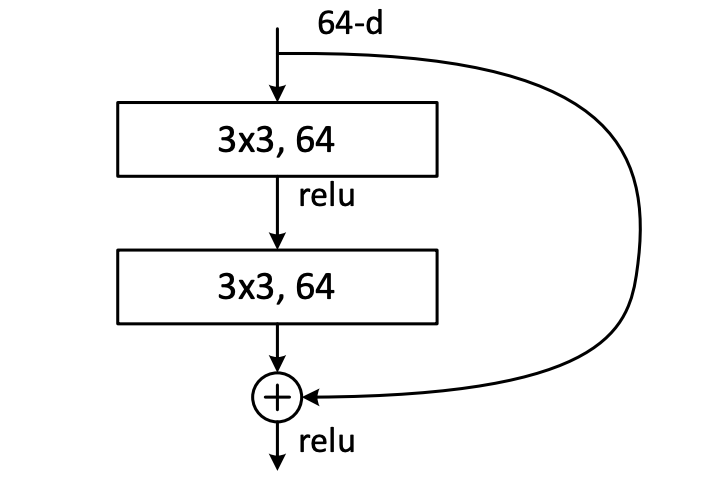
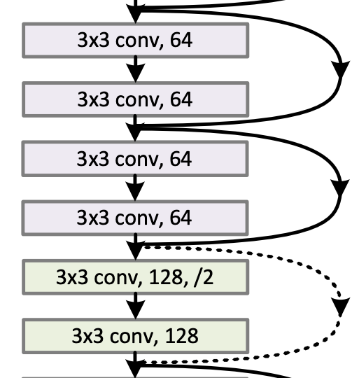

# Large Pretrained Model

Some models are pre-trained on large datasets, e.g., ImageNet, to perform a certain task like image classification or object detection. It appears that the models can capture different information at their layers. For example, the first layer captures the edge in the image, and the second captures the area, and so on. We can use the weights of these lower layers to further train for another task. This eliminates the need to train the model from scratch all the time.

In this section, we will look into popular pre-trained models.
- [ResNet](#residual-network-resnet)
- [MobileNet](#mobilenet)
- VGG
- Inception
- Xception

## Residual Network (ResNet)
[Deep Residual Learning for Image Recognition (He. et al, 2015)](https://arxiv.org/abs/1512.03385)


:::{note} 
Main idea: To use skip-connection to train a deep neural network.
:::

**Problem:** Deep networks, prior to ResNet, tends to have a problem in training when the model gets too deep. They tend to suffer from vanishing gradients, which the training signal can not pass back properly during the backpropagation.

````{panels}

---

````

**Solution:** To tackle this, ResNet uses **skip-connection**, as shown in the figure below. What skip-connection essentially does is that instead of just outputting $f(x)$, we add the initial value $x$ as well (denote by the curvy arrow). So, the output would be $f(x)+x$. During the backpropagation, if the gradient vanishes inside those rectangle blocks, it can skip them and go via the curvy arrow instead.

**How to use:** We can assume the figure (on the left) as one block. A block would have some convolution layers along with a skip-connection from the input of the block to its output. Then, we can just stack these blocks together to form one deep network (Figure on the right).


---


## MobileNet
[Reference](LINK)

:::note
Main Idea: Use Depth-wise Separable Convolution to replace a regular convolution block because it behaves similarly but reduce the number of parameters drastically.
:::

### Problem
Operation of convolution is quite intensive. 

Suppose we have an input image of size $D_x \times D_x \times M$ and a convolution block with kernel of size $D_k \times D_k \times M$. First, the conv block will do element-wise multiplication with a segment on the input image. Then, we sum the value along all the channels into a single value. The kernel then slides by one block to the right (if stride is 1), and the whole process is repeated until all ceils are covered. $N$ kernel is used to obtain $N$ channel as output.
<!-- 

{:.image-caption} -->

```{figure} https://miro.medium.com/max/1400/1*XloAmCh5bwE4j1G7yk5THw.png
---
name: regular-conv
width: 480px
align: center
---
Regular Convolution
(Source: https://towardsdatascience.com/a-basic-introduction-to-separable-convolutions-b99ec3102728)
```

Operations of a regular Conv block is roughly:
- One Conv Block's Operations: $D_k \cdot D_k \cdot M$
- One Block's Slide over the input: $D_x \cdot D_x$

Using $N$ conv blocks, the total operation is:
$$ T = D_k \cdot D_k \cdot M \cdot D_x \cdot D_x \cdot N$$

### Solution
One key challenge is that the conv multiplication is **repeated for all $N$ blocks**. For example, one conv block is applied to the top-left corner of the input. The second block will re-compute everything again. The idea of Depth-wise separable convolution block is to not repeat that element-wise multiplication.


Each of regular conv block does multiplication followed by additions. In depth-wise separable convolution, the process is splitted into two. One layer is for multiplication and another is for addition.
- Depthwise Convolution: This is similar to regular conv block except it does not perform additional across all channels. Hence, the operation is $D_k \cdot D_k \cdot M \cdot D_x \cdot D_x$.


```{figure} https://miro.medium.com/max/1400/1*yG6z6ESzsRW-9q5F_neOsg.png
---
name: depthwise-conv
width: 480px
align: center
---
Depthwise Convolution 
(Source: https://towardsdatascience.com/a-basic-introduction-to-separable-convolutions-b99ec3102728)
```

- Pointwise Convolution: This is a $1 \times 1 \times M$ kernel. $N$ kernels are used to obtain $N$ channels as output. The number of operations: $D_x \cdot D_x \cdot M \cdot N$.

```{figure} https://miro.medium.com/max/1400/1*37sVdBZZ9VK50pcAklh8AQ.png
---
name: pointwise-conv
width: 480px
align: center
---
Pointwise Convolution 
(Source: https://towardsdatascience.com/a-basic-introduction-to-separable-convolutions-b99ec3102728)
```


Total operations of Depth-wise Separable Convolution:
$$ (D_k \cdot D_k \cdot M \cdot D_x \cdot D_x) + (D_x \cdot D_x \cdot M \cdot N) $$

Let's compare:
$$
\frac{(D_k \cdot D_k \cdot M \cdot D_x \cdot D_x) + (D_x \cdot D_x \cdot M \cdot N)}{D_k \cdot D_k \cdot M \cdot D_x \cdot D_x \cdot N} =\frac{1}{N} + \frac{1}{D_k \cdot D_k}
$$

Here we can see that the depth-wise approach requires way less operations than the regular conv block.

### How to use
Instead of using a regular convolution layer, we use two layers. 

```{figure} ./figures/depth_conv_vs.png
---
name: depthwise-sep-conv-vs
align: center
width: 480px
---
Regular Conv vs. Depthwise Separable Conv
(Source: Original research paper)
```